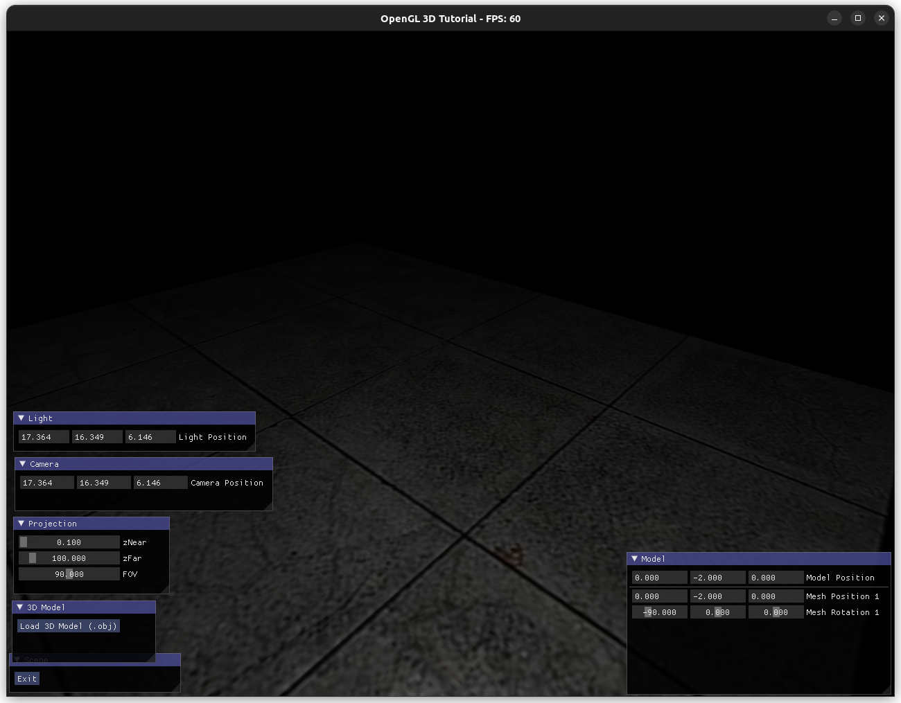
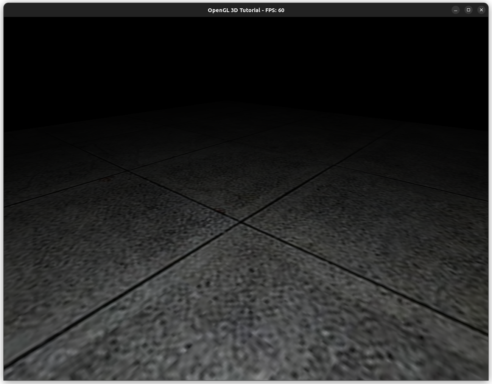

## OpenGL 4.6 3D Scene Playground

### **Status**

### TODO
- [ ] Models (.obj) are not visible in scene after loading
- [ ] Add a Skybox
- [ ] Single imgui controls window
- [ ] More runtime controls for lightning
- [ ] Organize & cleanup

[//]: # (###  Structure)
[//]: # (![assimp_struct]&#40;assimp_structure.png&#41;)

#### Notes
- When generating Blender Models, after Exporting Model obj make sure when 
setting path to save, left bottom there is options check `Triangulate Faces` because
Blender Exports by default Quads and we are drawing with triangles mode.

### Refs
https://www.youtube.com/playlist?list=PL6xSOsbVA1eYSZTKBxnoXYboy7wc4yg-Z

https://learnopengl.com/

https://open3dmodel.com/

https://assimp-docs.readthedocs.io/en/latest/